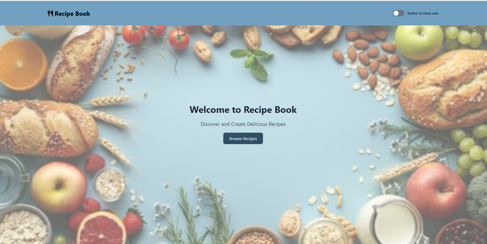
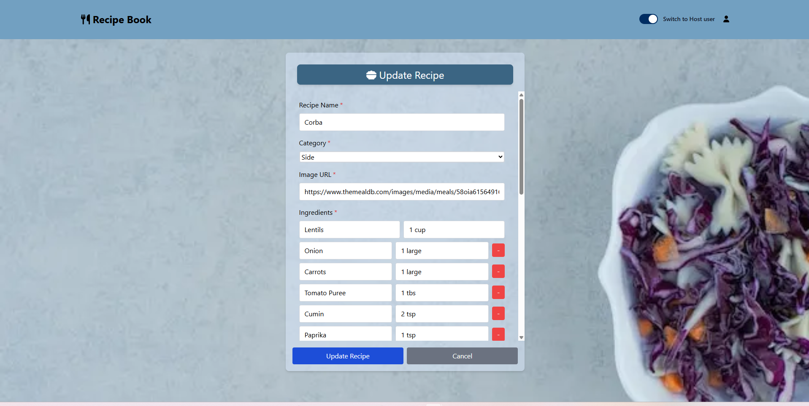
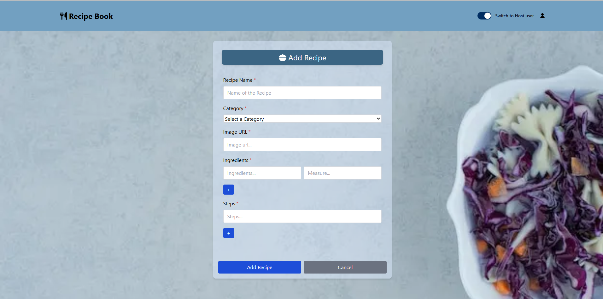
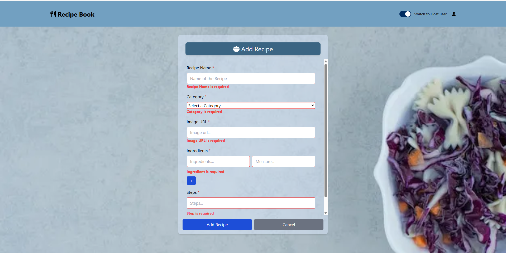

# Recipe-Book

This is a React App consists of host and guest users. Guest users can only see the list of the recipe and host users can delete and edit existing recipes. Also, Add new recipe. Host user can do these all the operations after Register or Login. In the Add recipe functionality host user can add all the details of the recipe such as title, image url, 
ingredients, steps and category of that recipe.

# Edit Recipe

# Add Recipe

